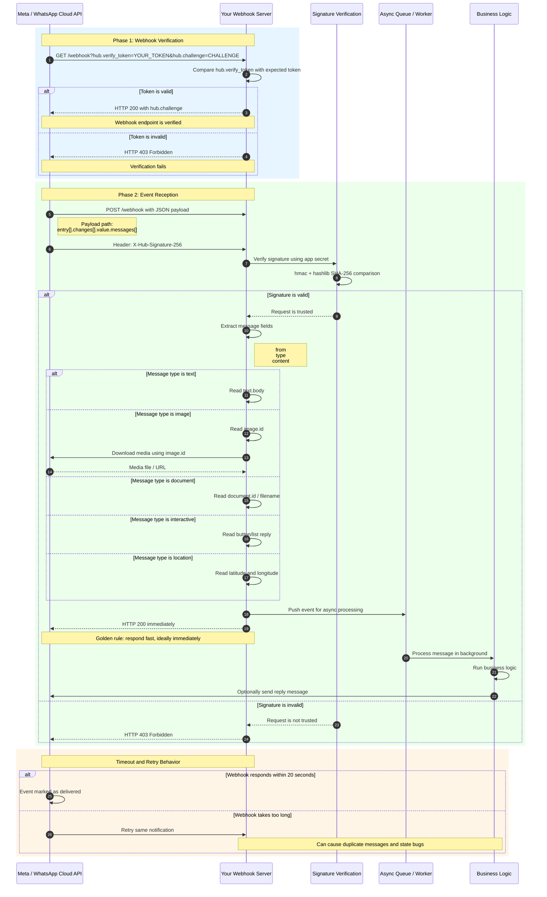
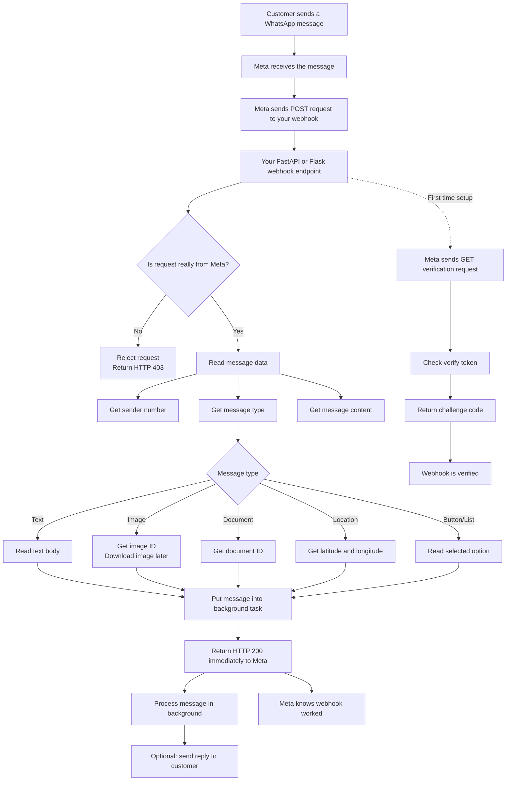
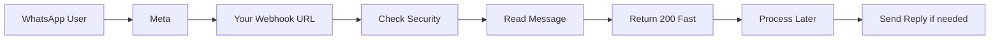

## Assistant



## User

can you give little more simpler diagram for begineer

## Assistant



A very simple mental model:



Key idea:

```text
Meta sends events to your webhook.
Your webhook checks the request, reads the message, returns 200 quickly,
then processes the message in the background.
```
